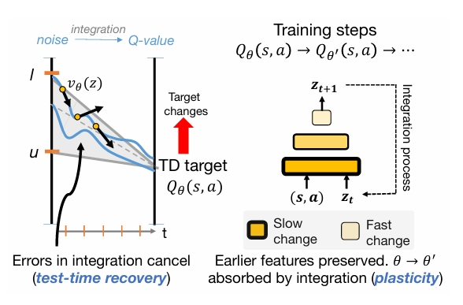

<div align="center">

<div id="user-content-toc" style="margin-bottom: 50px">
  <ul align="center" style="list-style: none;">
    <summary>
      <h1>What Does Flow-Matching Bring To TD Learning?</h1>
      <br>
      <h2><a href="https://arxiv.org/abs/2603.04333">Paper</a></h2>
    </summary>
  </ul>
</div>



</div>

## Overview

Recent work shows that flow matching can be effective for scalar Q-value function estimation in reinforcement learning (RL), but it remains unclear why or how this approach differs from standard critics. Contrary to  conventional belief, we show that their success is not explained by distributional RL, as explicitly modeling return distributions can reduce performance. Instead, we argue that the use of integration for reading out values and dense velocity supervision at each step of this integration process for training improves TD learning via two mechanisms. First, it enables robust value prediction through test-time recovery, whereby iterative computation through integration dampens errors in early value estimates as more integration steps are performed. This recovery mechanism is absent in monolithic critics. Second, supervising the velocity field at multiple interpolant values induces more plastic feature learning within the network, allowing critics to represent non-stationary TD targets without discarding previously learned features or overfitting to individual TD targets encountered during training. We formalize these effects and validate them empirically, showing that flow-matching critics substantially outperform monolithic critics (2× in final performance and around 5× in sample efficiency) in settings where loss  of plasticity poses a challenge e.g., in high-UTD online RL problems, while remaining stable during learning.

## Installation
```bash
conda env create -f conda-environment.yaml #replace the last line with the conda prefix on your system  
conda activate floqcritic
export MUJOCO_GL=egl
```


## Reproducing the main results

We provide the complete list of the **exact command-line flags**
used to produce the main results in the paper. We also provide the [wandbs](https://docs.google.com/spreadsheets/d/1VCuDtHWt5bEOXAWBRCYSqQ5Arwr23A-yZEInYQsGgBo/edit?usp=sharing). We ran three seeds (--seed=0, --seed=1, --seed=2) for each task.  


<details>
<summary><b>Click to expand the full list of commands</b></summary>

### Expected v/s Distributional Backup

```bash
#floq (distributional backup)

python main.py --env_name=antmaze-giant-navigate-singletask-v0 --agent=agents/floq_distributional.py --agent.discount=0.995 --agent.q_agg=min --agent.batch_size=512 --agent.alpha=10 --agent.critic_flow_steps=4

python main.py --env_name=humanoidmaze-medium-navigate-singletask-v0 --agent=agents/floq_distributional.py --agent.discount=0.995 --agent.alpha=30

python main.py --env_name=humanoidmaze-large-navigate-singletask-v0 --agent=agents/floq_distributional.py --agent.discount=0.995 --agent.batch_size=512 --agent.alpha=20 --agent.critic_flow_steps=16

python main.py --env_name=cube-double-play-singletask-v0 --agent=agents/floq_distributional.py --agent.alpha=300 --agent.block_depth=2

#floq (default -- expected backup)

python main.py --env_name=antmaze-giant-navigate-singletask-v0 --agent=agents/floq.py --agent.discount=0.995 --agent.q_agg=min --agent.batch_size=512 --agent.alpha=10 --agent.critic_flow_steps=4

python main.py --env_name=humanoidmaze-medium-navigate-singletask-v0 --agent=agents/floq.py --agent.discount=0.995 --agent.alpha=30

python main.py --env_name=humanoidmaze-large-navigate-singletask-v0 --agent=agents/floq.py --agent.discount=0.995 --agent.batch_size=512 --agent.alpha=20 --agent.critic_flow_steps=16

python main.py --env_name=cube-double-play-singletask-v0 --agent=agents/floq.py --agent.alpha=300 --agent.block_depth=2
```

### Predict Final v/s Predict Vel

```bash
#floq (predict final)

python main.py --env_name=antmaze-giant-navigate-singletask-v0 --agent=agents/floq_predict_final.py --agent.discount=0.995 --agent.q_agg=min --agent.batch_size=512 --agent.alpha=10 --agent.critic_flow_steps=4

python main.py --env_name=humanoidmaze-large-navigate-singletask-v0 --agent=agents/floq_predict_final.py --agent.discount=0.995 --agent.batch_size=512 --agent.alpha=20 --agent.critic_flow_steps=16

python main.py --env_name=cube-double-play-singletask-v0 --agent=agents/floq_predict_final.py --agent.alpha=300 --agent.block_depth=2

#floq (default -- predict vel)

python main.py --env_name=antmaze-giant-navigate-singletask-v0 --agent=agents/floq.py --agent.discount=0.995 --agent.q_agg=min --agent.batch_size=512 --agent.alpha=10 --agent.critic_flow_steps=4

python main.py --env_name=humanoidmaze-large-navigate-singletask-v0 --agent=agents/floq.py --agent.discount=0.995 --agent.batch_size=512 --agent.alpha=20 --agent.critic_flow_steps=16

python main.py --env_name=cube-double-play-singletask-v0 --agent=agents/floq.py --agent.alpha=300 --agent.block_depth=2
```

### Stale Network For Earlier Integration Steps

#### floq

```bash
#vary --agent.old_network_integration_steps in 0,2,4,6,8 

python main_staleness.py --env_name=humanoidmaze-medium-navigate-singletask-v0 --agent=agents/floq_staleness.py --agent.discount=0.995 --agent.alpha=30 --agent.old_network_integration_steps=6

python main_staleness.py --env_name=antsoccer-arena-navigate-singletask-v0 --agent=agents/floq_staleness.py --agent.discount=0.995 --agent.alpha=10 --agent.old_network_integration_steps=2

python main_staleness.py --env_name=cube-double-play-singletask-v0 --agent=agents/floq_staleness.py --agent.alpha=300 --agent.block_depth=2 --agent.old_network_integration_steps=4
```

### Target Noise 

#### floq

```bash
#vary --agent.target_noise_magnitude in 0,4,8,16 

python main.py --env_name=humanoidmaze-medium-navigate-singletask-v0 --agent=agents/floq_target_noise.py --agent.discount=0.995 --agent.alpha=30 --agent.target_noise_magnitude=4

python main.py --env_name=antsoccer-arena-navigate-singletask-v0 --agent=agents/floq_target_noise.py --agent.discount=0.995 --agent.alpha=10 --agent.target_noise_magnitude=16

python main.py --env_name=antmaze-large-navigate-singletask-v0 --agent=agents/floq_target_noise.py --agent.alpha=10 --agent.target_noise_magnitude=8
```

#### FQL

```bash
#vary --agent.target_noise_magnitude in 0,4,8,16 

python main.py --env_name=humanoidmaze-medium-navigate-singletask-v0 --agent=agents/fql_target_noise.py --agent.discount=0.995 --agent.alpha=30 --agent.target_noise_magnitude=4

python main.py --env_name=antsoccer-arena-navigate-singletask-v0 --agent=agents/fql_target_noise.py --agent.discount=0.995 --agent.alpha=10 --agent.target_noise_magnitude=8

python main.py --env_name=antmaze-large-navigate-singletask-v0 --agent=agents/fql_target_noise.py --agent.alpha=10 --agent.target_noise_magnitude=16
```

### Feature Norm Tracking 

#### floq

```bash
#vary --agent.training_type in 'mc', 'sarsa', 'ql' 

python main_floq_feature_norm.py --env_name=antmaze-giant-navigate-singletask-v0 --agent=agents/floq_feature_norm.py --agent.discount=0.995 --agent.q_agg=min --agent.batch_size=512 --agent.alpha=10 --agent.critic_flow_steps=4 --agent.training_type='ql'

python main_floq_feature_norm.py --env_name=humanoidmaze-medium-navigate-singletask-v0 --agent=agents/floq_feature_norm.py --agent.discount=0.995 --agent.alpha=30 --agent.training_type='mc'

python main_floq_feature_norm.py --env_name=humanoidmaze-large-navigate-singletask-v0 --agent=agents/floq_feature_norm.py --agent.discount=0.995 --agent.batch_size=512 --agent.alpha=20 --agent.critic_flow_steps=16 --agent.training_type='sarsa'

python main_floq_feature_norm.py --env_name=antsoccer-arena-navigate-singletask-v0 --agent=agents/floq_feature_norm.py --agent.discount=0.995 --agent.alpha=10 --agent.training_type='ql'

python main_floq_feature_norm.py --env_name=cube-double-play-singletask-v0 --agent=agents/floq_feature_norm.py --agent.alpha=300 --agent.block_depth=2 --agent.training_type='mc'
```

#### FQL

```bash
#vary --agent.training_type in 'mc' , 'sarsa', 'ql'

python main_fql_feature_norm.py --env_name=antmaze-giant-navigate-singletask-v0 --agent=agents/fql_feature_norm.py --agent.discount=0.995 --agent.q_agg=min --agent.batch_size=512 --agent.alpha=10 --agent.training_type='sarsa'

python main_fql_feature_norm.py --env_name=humanoidmaze-medium-navigate-singletask-v0 --agent=agents/fql_feature_norm.py --agent.discount=0.995 --agent.alpha=30 --agent.training_type='mc'

python main_fql_feature_norm.py --env_name=humanoidmaze-large-navigate-singletask-v0 --agent=agents/fql_feature_norm.py --agent.discount=0.995 --agent.batch_size=512 --agent.alpha=30 --agent.training_type='ql'

python main_fql_feature_norm.py --env_name=antsoccer-arena-navigate-singletask-v0 --agent=agents/fql_feature_norm.py --agent.discount=0.995 --agent.alpha=10 --agent.training_type='mc'

python main_fql_feature_norm.py --env_name=cube-double-play-singletask-v0 --agent=agents/fql_feature_norm.py --agent.alpha=300 --agent.training_type='ql'
```

### Plasticity 

#### floq

```bash

python main_plasticity.py --env_name=antmaze-giant-navigate-singletask-v0 --agent=agents/floq_plasticity.py --agent.discount=0.995 --agent.q_agg=min --agent.batch_size=512 --agent.alpha=10 --agent.critic_flow_steps=4

python main_plasticity.py --env_name=antsoccer-arena-navigate-singletask-v0 --agent=agents/floq_plasticity.py --agent.discount=0.995 --agent.alpha=10 

python main_plasticity.py --env_name=cube-double-play-singletask-v0 --agent=agents/floq_plasticity.py --agent.alpha=300 --agent.block_depth=2

python main_plasticity.py --env_name=puzzle-4x4-play-singletask-v0 --agent=agents/floq_plasticity.py --agent.alpha=1000 --agent.noise_coverage=0.25

```

#### floq (train_at_zero_only)

```bash

python main_plasticity.py --env_name=antmaze-giant-navigate-singletask-v0 --agent=agents/floq_plasticity.py --agent.discount=0.995 --agent.q_agg=min --agent.batch_size=512 --agent.alpha=10 --agent.train_at_zero_only=True --agent.critic_flow_steps=1

python main_plasticity.py --env_name=antsoccer-arena-navigate-singletask-v0 --agent=agents/floq_plasticity.py --agent.discount=0.995 --agent.alpha=10 --agent.train_at_zero_only=True --agent.critic_flow_steps=1 

python main_plasticity.py --env_name=cube-double-play-singletask-v0 --agent=agents/floq_plasticity.py --agent.alpha=300 --agent.block_depth=2 --agent.train_at_zero_only=True --agent.critic_flow_steps=1

python main_plasticity.py --env_name=puzzle-4x4-play-singletask-v0 --agent=agents/floq_plasticity.py --agent.alpha=1000 --agent.noise_coverage=0.25 --agent.train_at_zero_only=True --agent.critic_flow_steps=1

```

#### FQL

```bash

python main_plasticity.py --env_name=antmaze-giant-navigate-singletask-v0 --agent=agents/fql_plasticity.py --agent.discount=0.995 --agent.q_agg=min --agent.batch_size=512 --agent.alpha=10

python main_plasticity.py --env_name=antsoccer-arena-navigate-singletask-v0 --agent=agents/fql_plasticity.py --agent.discount=0.995 --agent.alpha=10 

python main_plasticity.py --env_name=cube-double-play-singletask-v0 --agent=agents/fql_plasticity.py --agent.alpha=300

python main_plasticity.py --env_name=puzzle-4x4-play-singletask-v0 --agent=agents/fql_plasticity.py --agent.alpha=1000

```

#### FQL (ResNet)

```bash

python main_plasticity.py --env_name=antmaze-giant-navigate-singletask-v0 --agent=agents/fql_resnet_plasticity.py --agent.discount=0.995 --agent.q_agg=min --agent.batch_size=512 --agent.alpha=10

python main_plasticity.py --env_name=antsoccer-arena-navigate-singletask-v0 --agent=agents/fql_resnet_plasticity.py --agent.discount=0.995 --agent.alpha=10 

python main_plasticity.py --env_name=cube-double-play-singletask-v0 --agent=agents/fql_resnet_plasticity.py --agent.alpha=300

python main_plasticity.py --env_name=puzzle-4x4-play-singletask-v0 --agent=agents/fql_resnet_plasticity.py --agent.alpha=1000


```

#### FQL (Transformer)

```bash

python main_plasticity.py --env_name=antmaze-giant-navigate-singletask-v0 --agent=agents/fql_transformer_plasticity.py --agent.discount=0.995 --agent.q_agg=min --agent.batch_size=512 --agent.alpha=10

python main_plasticity.py --env_name=antsoccer-arena-navigate-singletask-v0 --agent=agents/fql_transformer_plasticity.py --agent.discount=0.995 --agent.alpha=10 

python main_plasticity.py --env_name=cube-double-play-singletask-v0 --agent=agents/fql_transformer_plasticity.py --agent.alpha=300

python main_plasticity.py --env_name=puzzle-4x4-play-singletask-v0 --agent=agents/fql_transformer_plasticity.py --agent.alpha=1000

```

### RLPD 

#### floq

```bash
# vary --utd_ratio in 1,2,4,8,16,32,64,128

python main_rlpd.py --utd_ratio=128 --env_name=antmaze-giant-navigate-singletask-v0 --agent=agents/floq.py --agent.discount=0.995 --agent.q_agg=min --agent.batch_size=512 --agent.alpha=10 --agent.critic_flow_steps=4

python main_rlpd.py --utd_ratio=64 --env_name=antsoccer-arena-navigate-singletask-v0 --agent=agents/floq.py --agent.discount=0.995 --agent.alpha=10 

python main_rlpd.py --utd_ratio=32 --env_name=humanoidmaze-large-navigate-singletask-v0 --agent=agents/floq.py --agent.discount=0.995 --agent.batch_size=512 --agent.alpha=20 --agent.critic_flow_steps=16

python main_rlpd.py --utd_ratio=16 --env_name=humanoidmaze-medium-navigate-singletask-v0 --agent=agents/floq.py --agent.discount=0.995 --agent.alpha=30

```

#### FQL

```bash
# vary --utd_ratio in 1,2,4,8,16,32,64,128

python main_rlpd.py --utd_ratio=32 --env_name=antmaze-giant-navigate-singletask-v0 --agent=agents/fql.py --agent.discount=0.995 --agent.q_agg=min --agent.batch_size=512 --agent.alpha=10 

python main_rlpd.py --utd_ratio=64 --env_name=antsoccer-arena-navigate-singletask-v0 --agent=agents/fql.py --agent.discount=0.995 --agent.alpha=10 

python main_rlpd.py --utd_ratio=16 --env_name=humanoidmaze-large-navigate-singletask-v0 --agent=agents/fql.py --agent.discount=0.995 --agent.batch_size=512 --agent.alpha=30

python main_rlpd.py --utd_ratio=128 --env_name=humanoidmaze-medium-navigate-singletask-v0 --agent=agents/fql.py --agent.discount=0.995 --agent.alpha=30

```


</details>

## Acknowledgments
This codebase is built on top of [FQL](https://github.com/seohongpark/fql)'s reference implementations.
